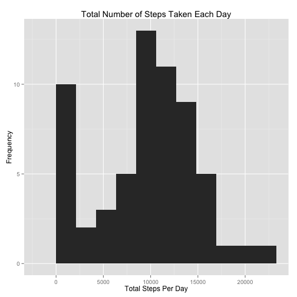
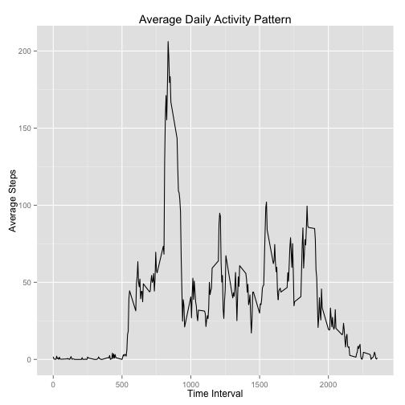
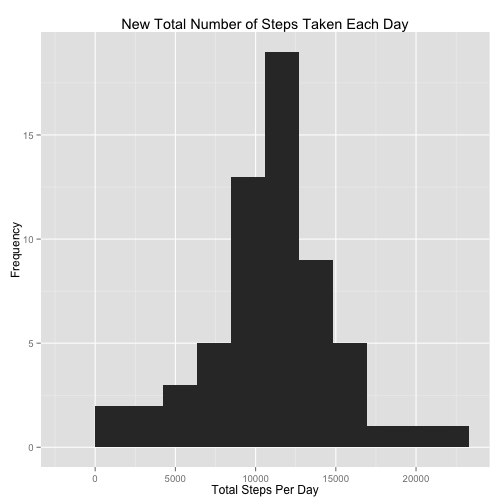
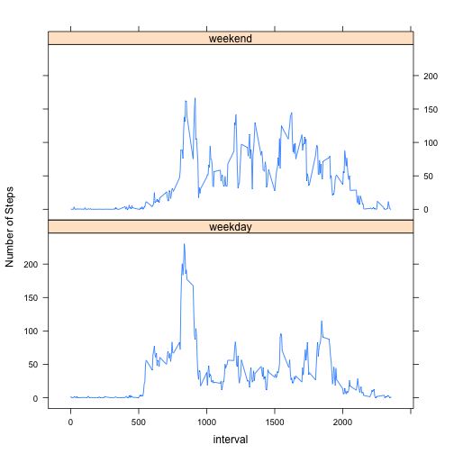

## Loading and preprocessing the data
First, check to see if data already exists. If not, the activity.csv file is extracted from the zip file. The .csv file is then read and loaded into `act` dataframe.

```r
# Check to see if the unzipped .csv file exists. If not, unzip the zip file
if(!file.exists("activity.csv")){
    unzip("activity.zip")
}

# Load the csv into variable act
act <- read.csv("activity.csv")
```
Next, we transform the `date` variable to the Date class so we can use it later.

```r
# Transform the date variable from factor class to Date class for later use
act <- transform(act, date = as.Date(act$date, format = "%Y-%m-%d"))
```

## What is mean total number of steps taken per day?

**Plot the histogram of the total number of steps taken each day**


```r
# load ggplot2 package
library(ggplot2)

# calculate the total number of steps taken each day
daySteps <- tapply(act$steps, act$date, sum, na.rm = TRUE)

# create a histogram of daySteps with 10 bins
qplot(daySteps, binwidth = max(daySteps/10), xlab = "Total Steps Per Day",
      ylab = "Frequency", main = "Total Number of Steps Taken Each Day")
```

 

**Calculate and report the mean and median total number of steps taken per day**

```r
meanDaySteps <- round(mean(daySteps))
medianDaySteps <- median(daySteps)
```
The mean total number of steps taken per day is **9354**.  
The median total number of steps taken per day is **10395**.


## What is the average daily activity pattern?
**Time series plot of the 5-minute interval and the average number of steps taken, averaged across all days**

```r
# calculate the average number of steps taken for each 5-minute interval
avgSteps <- aggregate(list(steps = act$steps), list(interval = act$interval), mean, na.rm = TRUE)
# create a time series plot of interval vs avg steps
ggplot(avgSteps, aes(interval, steps)) + geom_line() + xlab("Time Interval") +
      ylab("Average Steps") + ggtitle("Average Daily Activity Pattern") 
```

 

**Which 5-minute interval, on average across all the days in the dataset, contains the maximum number of steps?**

```r
# find the 5-minute interval that contains the maximum number of steps
maxInterval <- names(avgSteps)[which(avgSteps == max(avgSteps))]
```
The 5-minute interval with the maximum number of average steps taken across all days in dataset is **NA**.

## Imputing missing values
**Calculate and report the total number of missing values in the dataset (i.e. the total number of rows with `NA`s)**

```r
# total number of missing values in the dataset
numMissing <- sum(is.na(act$steps))
```
Total number of missing values in dataset is **2304**. 

**Devise a strategy for filling in all of the missing values in the dataset.**

We will replace the missing values with the mean number of steps taken across all days for the corresponding time intervals.

**Create a new dataset that is equal to the original dataset but with the missing data filled in.**

New data set `newAct` is created by copying `act` first, and then replacing the values with the corresponding interval averages.


```r
# create new dataframe by copying original
newAct <- act

# find indicies of the NA values in original dataset
missingVal <- which(is.na(act$steps))

# replace the NA values with the corresponding interval averages
newAct$steps[missingVal] = rep(avgSteps$steps, 288)[missingVal]
```

**Make a histogram of the total number of steps taken each day and Calculate and report the mean and median total number of steps taken per day. Do these values differ from the estimates from the first part of the assignment? What is the impact of imputing missing data on the estimates of the total daily number of steps?**  

Histogram of the total number of steps taken each day from new dataset

```r
# calculate the total number of steps taken each day
newDaySteps <- tapply(newAct$steps, newAct$date, sum)

# create a histogram with 10 bins
qplot(newDaySteps, binwidth = max(newDaySteps/10), xlab = "Total Steps Per Day",
      ylab = "Frequency", main = "New Total Number of Steps Taken Each Day")
```

 

```r
# Calculate the mean and median
newMeanDaySteps <- format(mean(newDaySteps), scientific = FALSE)
newMedianDaySteps <- format(median(newDaySteps), scientific = FALSE)
```
The new mean total number of steps taken per day is **10766.19**, whereas the previous mean was 9354.  
The new median total number of steps taken per day is **10766.19**, whereas the previous median was 10395.  

Imputing the missing values resulted in the estmates of the total number of steps to be larger than than previously calculated. This is a reasonable result, since previously the missing datapoints were disregarded completely. Adding these results back in will increase the mean and median regardless of magnitude.

## Are there differences in activity patterns between weekdays and weekends?
**Create a new factor variable in the dataset with two levels -- "weekday" and "weekend" indicating whether a given date is a weekday or weekend day.**

```r
# define vector for weekday
wkdy <- c("Monday", "Tuesday", "Wednesday", "Thursday", "Friday")

# create new variable dayType in newAct; if a day is contained in wkdy vector
# its dayType will be "weekday", otherwise it will be "weekend"
newAct$dayType = ifelse(weekdays(newAct$date) %in% wkdy, "weekday", "weekend")
```

**Make a panel plot containing a time series plot of the 5-minute interval (x-axis) and the average number of steps taken, averaged across all weekday days or weekend days (y-axis).**

```r
# aggregate the average number of steps by interval and dayType
result <- aggregate(newAct$steps, list(interval = newAct$interval, 
                                       dayType = newAct$dayType), mean)
# Create a time series plot of interval vs avg steps
library(lattice)
xyplot(x ~ interval | dayType, result, layout=c(1,2), type = "l", ylab = "Number of Steps")
```

 

There are slight differences in the daily activity patterns between weekdays and weekends on average:  

1. the number of steps recorded during the earlier part of the day (from 5:00 to 9:00) is substantially **higher on weekdays** than weekends  
2. step activity tends to be slightly **higher on weekends** during the middle parts of the day (from 10:00 to 18:00)  
3. step activity drops to inactive/low levels **a bit later on weekends** (around 21:00) than on weekdays (around 20:00)
